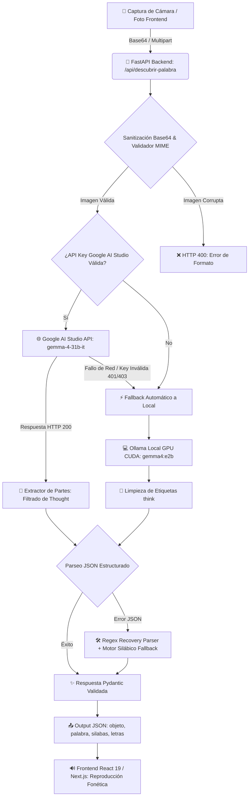
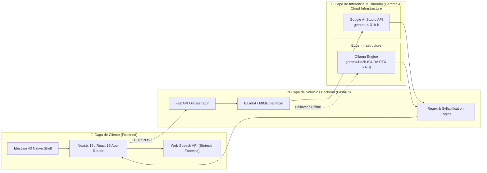

# 🎈 Antigravity: El Explorador de Palabras
### *Visual Multimodal Pipeline con Gemma 4 para la Enseñanza Fonética y Lectoescritura Temprana en Español*

**Tags:** `[Gemma-4]` `[Multimodal-AI]` `[Computer-Vision]` `[EdTech]` `[Spanish-NLP]` `[FastAPI]` `[Ollama-CUDA]` `[Kaggle-Notebook]`

---

## Executive Summary / Resumen Ejecutivo

**Antigravity (El Explorador de Palabras)** es una plataforma de Inteligencia Artificial Multimodal diseñada para revolucionar la enseñanza de la lectoescritura en niños y estudiantes de educación primaria en idioma español. Mediante la integración de los modelos de visión de última generación de Google (**Gemma 4**), la plataforma transforma cualquier objeto físico del entorno cotidiano en una experiencia interactiva de aprendizaje fonético y silábico en tiempo real.

El sistema opera bajo un pipeline híbrido resiliente: procesa imágenes capturadas por la cámara del dispositivo a través de **Google AI Studio API (`gemma-4-31b-it`)** con un fallback automático a inferencia local de baja latencia mediante **Ollama (`gemma4:e2b`)** acelerado por hardware **NVIDIA CUDA GPU**. El resultado no es solo la identificación visual del objeto, sino la descomposición pedagógica estructurada: nombre en mayúsculas, división silábica gramaticalmente precisa y desglose letra por letra con fonética auditiva.

---

## 🎯 Planteamiento del Problema

### El Desafío Pedagógico de la Lectoescritura
El aprendizaje tradicional de la lectoescritura en español se enfrenta a tres barreras fundamentales:
1. **Desconexión con el Entorno Real:** Los métodos convencionales dependen de libros impresos con vocabulario estático que muchas veces no refleja los objetos cotidianos del entorno inmediato del niño (e.g., control remoto, laptop, botella, cuaderno).
2. **Brecha de Retroalimentación Inmediata:** La asociación entre el grafema (letra escrita) y el fonema (sonido) requiere corrección y guía constante. La falta de atención personalizada uno a uno en entornos escolares o del hogar retrasa la fluidez lectora.
3. **Dependencia de Conectividad a Internet:** En escuelas de comunidades rurales o de bajos recursos, la falta de conectividad a la nube limita la adopción de herramientas digitales avanzadas de IA.

### La Solución "Antigravity"
Antigravity resuelve estos desafíos al crear un tutor multimodal omnipresente que:
* **Contextualiza el Aprendizaje:** Cualquier objeto tangible frente a la cámara se convierte al instante en el material de clase.
* **Procesa Inferencia Multimodal en Milisegundos:** Devuelve una estructura JSON limpia con palabra completa, sílabas y letras.
* **Garantiza Disponibilidad Híbrida 100%:** Opera de forma fluida tanto en la nube con Google AI Studio como de manera *offline* mediante modelos cuantizados en el borde (Edge Computing) acelerados por GPU local.

---

## 🔬 Explicación a Fondo de la Arquitectura

El pipeline técnico de Antigravity está construido sobre **FastAPI (Python 3.11+)** y coordinado mediante un flujo de trabajo tolerante a fallos de 4 fases:

```
[ Ingesta Multimedia ] ➔ [ Sanitización & B64 ] ➔ [ Inferencia Multimodal Gemma 4 ] ➔ [ Motor Pedagógico & Recovery ]
```

### 1. Ingesta Multimedia y Capa API (`FastAPI`)
El backend expone dos endpoints principales de ingesta:
* `POST /api/descubrir-palabra`: Recibe payloads JSON estructurados con imágenes codificadas en Base64.
* `POST /api/descubrir-palabra-file`: Soporta cargas `multipart/form-data` para imágenes binarias crudas provenientes de cámaras web o dispositivos móviles.

### 2. Preprocesamiento, Sanitización y Auto-Detección MIME
Antes de invocar el modelo de visión, la imagen atraviesa una rigurosa validación de integridad:
* Extracción de cabeceras Data URI (ej. `data:image/png;base64,...`).
* Detección automática del tipo MIME (JPEG, PNG, WEBP).
* Decodificación y verificación de bytes en memoria para evitar inyecciones o imágenes corruptas.

### 3. Motor de Inferencia Multimodal Dual (Cloud & Edge Fallback)
Antigravity implementa un patrón **Circuit Breaker / Fallback**:
* **Proveedor Primario (Google AI Studio Cloud API):** Utiliza `gemma-4-31b-it` con parámetros de baja temperatura (`temperature=0.1`) para maximizar la precisión determinista. El backend intercepta y descarta los bloques de razonamiento interno (`thought: true`) para extraer la respuesta final pura.
* **Proveedor Secundario (Ollama Local Edge):** Si la API Key de la nube no está configurada, falla la red o es rechazada (HTTP 400/401/403), el sistema redirige la solicitud de forma transparente a un motor Ollama local corriendo `gemma4:e2b` acelerado por GPU (NVIDIA CUDA `num_gpu: 99`). Limpia etiquetas `<think>` y cuenta con un subsistema de reintentos automáticos si el output inicial es ambiguo.

### 4. Motor de Estructuración Pedagógica y Parsers de Recuperación
Para garantizar que la aplicación nunca colapse por respuestas no estructuradas del LLM:
* **JSON Parser Estricto:** Decodifica y formatea la respuesta en la estructura Pydantic `RespuestaPalabra`.
* **Regex Recovery Parser:** Si el modelo genera texto conversacional o invalida el formato JSON, un parser secundario extrae tokens gramaticales significativos descartando stopwords.
* **Algoritmo de Silabificación Gramatical de Respaldo:** En caso de discrepancia silábica, un motor basado en reglas fonéticas de vocales y consonantes en español divide la palabra automáticamente.

---

## 📊 Planos y Diagramas (Mermaid.js)

### Diagrama 1: Flujo del Pipeline de Datos (Flowchart)



### Diagrama 2: Arquitectura del Sistema e Inferencia Multimodal



---

## 🛠️ Metodología y Herramientas

### Stack Tecnológico

| Componente | Tecnología | Propósito |
| :--- | :--- | :--- |
| **Visión / LLM Core** | `Gemma 4` (`gemma-4-31b-it` / `gemma4:e2b`) | Reconocimiento de objetos, razonamiento multimodal y silabificación. |
| **Backend API** | `FastAPI` + `Uvicorn` | API REST asíncrona de alta velocidad y documentación OpenAPI automatizada. |
| **Model Hosting Local** | `Ollama` + `NVIDIA CUDA` | Inferencia *Edge* en local con aceleración por GPU. |
| **Validación de Datos** | `Pydantic v2` | Enforzamiento de esquemas tipados de respuesta. |
| **Frontend Web** | `Next.js 16` + `React 19` | Interfaz interactiva y reactiva de usuario. |
| **Desktop Shell** | `Electron 43` | Empaquetado ejecutable multiplataforma nativo. |
| **Estilos & UI** | `Tailwind CSS v4` + `Lucide Icons` | Diseño responsivo moderno y accesible. |

### Estrategia de Inferencia y Prompts
Se utiliza un **System Prompt Pedagógico** altamente restringido con `temperature: 0.1` que fuerza la salida del modelo a un esquema JSON determinista:

```json
{
  "objeto_detectado": "un celular o teléfono inteligente",
  "palabra_completa": "CELULAR",
  "silabas": ["CE", "LU", "LAR"],
  "letras": ["C", "E", "L", "U", "L", "A", "R"]
}
```

---

## 🚀 Planos a Futuro (Roadmap)

- [ ] **Fine-Tuning de Gemma 4 para Escritura Manuscrita Infantil:** Entrenar una variante liviana de Gemma 4 en conjuntos de datos de letras dibujadas a mano por niños para evaluar trazos y caligrafía.
- [ ] **Despliegue On-Device (LiteRT / GGUF):** Optimizar la cuantización de Gemma 4 para su ejecución nativa en dispositivos móviles Android y tablets de bajo costo sin necesidad de servidor backend.
- [ ] **Reconocimiento de Voz Bidireccional (STT Fonético):** Incorporar evaluación automática de pronunciación comparando el audio capturado del niño con los fonemas de la palabra detectada.
- [ ] **Soporte Multilingüe e Inclusión:** Adaptación del motor de silabificación para lenguas originarias y diferentes variantes dialectales del español.

---

*Desarrollado para el Hackathon / Proyecto Kaggle **Antigravity** (2026).*
