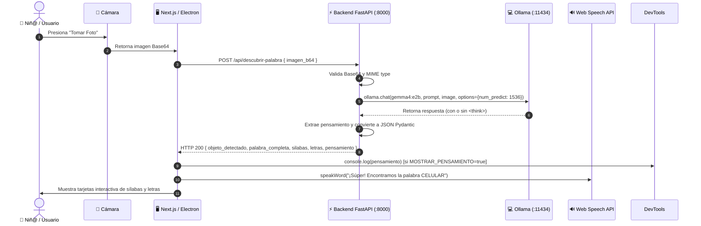

# 🧠 Explicación Conceptual: Arquitectura y Pipeline Multimodal

**Propósito:** Análisis a fondo sobre las decisiones de diseño del pipeline multimodal, la estrategia de tolerancia a fallos y la arquitectura técnica de **"Mi Explorador de Palabras"**.

---

## 🏛️ Visión General de la Arquitectura

La plataforma combina un cliente de interfaz reactiva (**Next.js 16 + React 19 / Electron 43**) con un servidor de procesamiento en **Python FastAPI**, el cual coordina modelos de visión artificial multimodal de la familia **Gemma 4**.

```mermaid
graph TD
    subgraph Client ["📱 Capa de Cliente (Electron 43 / Next.js 16)"]
        Camera["📸 CameraView Component"] -->|Base64 Data URI| Controller["App Controller (page.tsx)"]
        Controller -->|Synthesize Voice| AudioEngine["🔊 Web Speech API (es-MX)"]
        DevTools["🧠 Consola F12"] <==|MOSTRAR_PENSAMIENTO=true| Controller
    end

    subgraph Backend ["⚙️ Capa de Servicio Backend (FastAPI :8000)"]
        Endpoint["POST /api/descubrir-palabra"] --> Validation["Base64 Sanitizer & MIME Detector"]
        Validation --> ProviderRouter{"¿Configuración de Proveedor?"}
        
        ProviderRouter -->|USE_OLLAMA_FALLBACK=true| LocalWorker["💻 Ollama Engine (:11434)<br>Modelo: gemma4:e2b (CUDA GPU)"]
        ProviderRouter -->|API Key Activa| CloudWorker["🌐 Google AI Studio API<br>Modelo: gemma-4-31b-it"]
        
        LocalWorker --> ThoughtFilter["🧹 Filtrado <think> & Extractor JSON"]
        CloudWorker --> ThoughtFilter
        
        ThoughtFilter --> RecoveryCheck{"¿JSON Válido?"}
        RecoveryCheck -->|Sí| PydanticOutput["✨ Respuesta Pydantic Validada"]
        RecoveryCheck -->|No| RegexEngine["🛠️ Parser Regex + Silabificación Fallback"]
        RegexEngine --> PydanticOutput
    end

    Controller -->|HTTP POST| Endpoint
    PydanticOutput -->|Respuesta JSON| Controller
```

---

## 🔄 Diagrama de Secuencia de la Petición



---

## 🛡️ Estrategia de Resiliencia y Fallback de 3 Capas

Para garantizar que la experiencia del niño nunca se vea interrumpida por fallos de formato en el modelo de lenguaje:

1. **Capa 1: Inferencia Determinista de Baja Temperatura**:
   Se envía la solicitud con `temperature: 0.1` y `top_p: 0.9` junto a un System Prompt estrictamente formateado para solicitar un esquema JSON puro.

2. **Capa 2: Extractor de Pensamiento e Inmunidad a Truncamiento**:
   Gemma 4 utiliza **Thinking Mode**. Se amplió el parámetro `num_predict` a **1536 tokens** y se implementó un parser con Regex `re.search(r'<think>(.*?)(?:</think>|$)', ...)` que previene colapsos incluso si la etiqueta de pensamiento no se cierra.

3. **Capa 3: Motor de Recuperación por Regex y Silabificación en Español**:
   Si el LLM genera texto conversacional accidental, un segundo motor en Python localiza la palabra principal mediante expresiones regulares (`r'\b[A-ZÑ]{2,20}\b'`) y reconstruye automáticamente las sílabas gramaticales mediante reglas fonéticas en español.

---

## 🔊 Motor de Fonética y Nombres de Letras en Español

En [`src/lib/phonics.ts`](file:///C:/Users/davec/Projects/hackday/src/lib/phonics.ts), la aplicación traduce cada carácter a su nombre fonético oficial en idioma español (`"ce"`, `"ele"`, `"eme"`, `"ene"`, `"ere"`, `"ese"`, `"ve"`, etc.) garantizando una pronunciación clara con la voz nativa `es-MX`.
